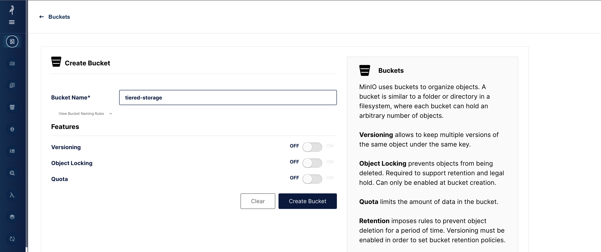
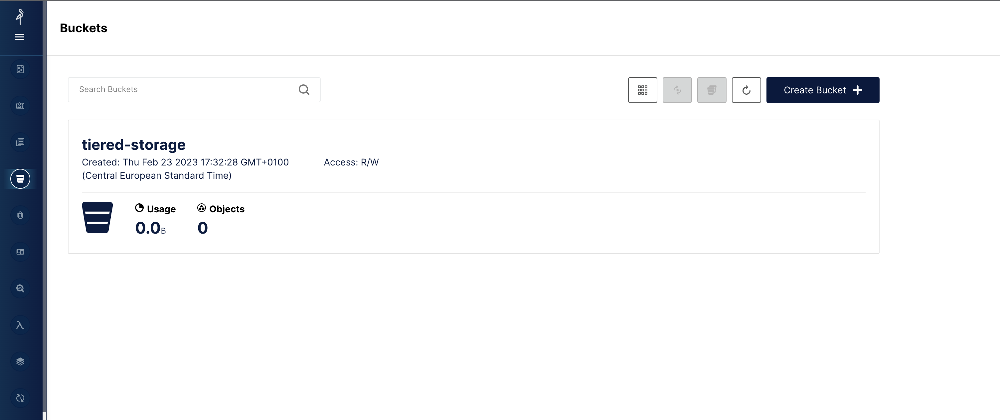
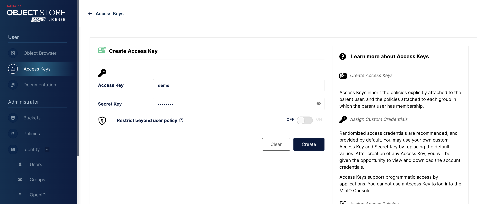
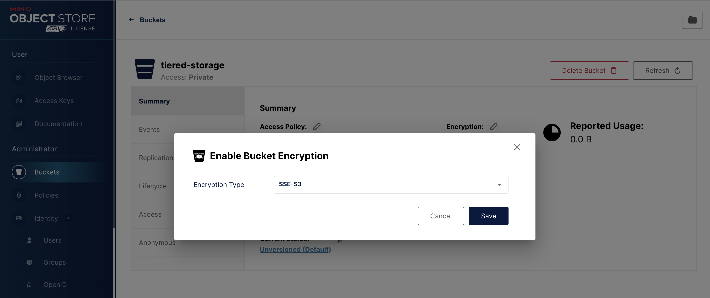
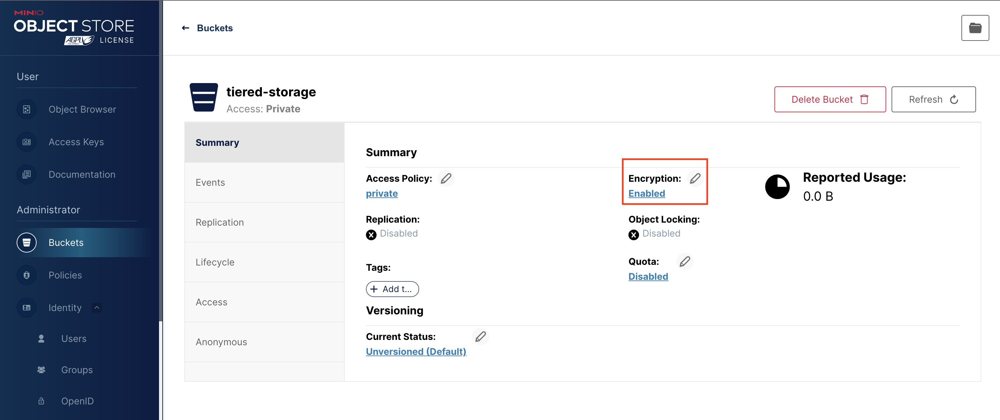
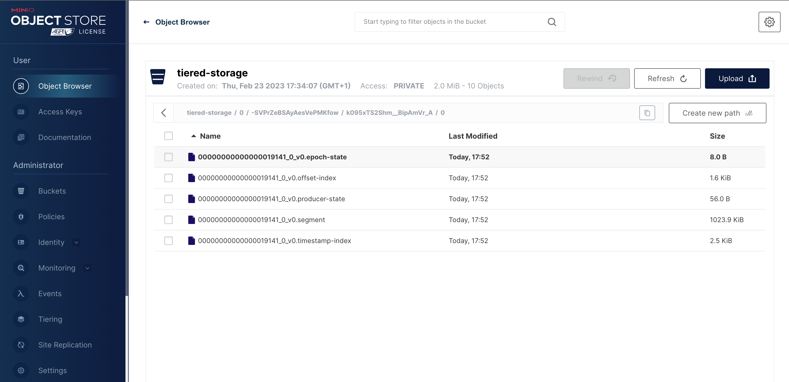
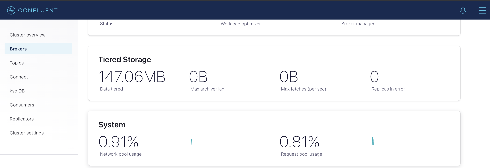

# confluent-tiered-storage

### Prerequisits


### Create certs for kes

As mentioned above we need encrypted minio buckets to work with Confluent Tiered Storage.


TLS private key and self-signed cert (adapt the dir  if needed)

```bash

openssl req -x509 -nodes -days 7300 -newkey rsa:2048 -keyout kes/server.key -out kes/server.cert \
 -subj "/C=/ST=/L=/O=/CN=localhost" -addext "subjectAltName = IP:127.0.0.1, DNS:minio-kes"

```

The output should look like:

<details>
  <summary>Details</summary>

```bash
Generating a RSA private key
.......+++++
...............................................................................................+++++
writing new private key to 'server.key'
-----
req: No value provided for Subject Attribute C, skipped
req: No value provided for Subject Attribute ST, skipped
req: No value provided for Subject Attribute L, skipped
req: No value provided for Subject Attribute O, skipped

```
</details>  
  
Next we create a TLS private/public key pair for client authentication.

```bash
docker run -v $PWD/kes:/root minio/kes  identity new --cert /root/client.cert --key /root/client.key myapp
```


Again example output for reference
<details>
  <summary>Details</summary>

```bash

Your API key:

   kes:v1:ACTnWlStnksF1ghlVujO1/Y/DLuSVADNAih6bnCvpqxu

This is the only time it is shown. Keep it secret and secure!

Your Identity:

   2a84d486c770740c4ca256c4ec3aa1458b29a398a1edefca38f408c6a865fd9d

The identity is not a secret. It can be shared. Any peer
needs this identity in order to verify your API key.

The generated TLS private key is stored at: /root/client.key
The generated TLS certificate is stored at: /root/client.crt

The identity can be computed again via:

    kes identity of kes:v1:ACTnWlStnksF1ghlVujO1/Y/DLuSVADNAih6bnCvpqxu
    kes identity of /root/client.crt
```
</details>    

we will need this identity from above for configuring the kes server.


### configure the kes server

copy identy from above to config.yml

start kes with

```
docker-compose -f docker-compose-kes.yml up -d 
```

check the logs for any erros with

```bash
docker logs minio-kes
```
### prepare minio

copy the created certs from kes directory to minio data directory

```bash
cp kes/client.* data/minio
cp kes/server.cert data/minio
```

### start minio only with 
adapt minio root user and password if needed

```bash
docker-compose up -d minio
```


### create a bucket for our demo case
login to minio webui http://127.0.0.1:9090

### create a bucket
choose a proper name and keep the rest with the defaults






### create an access key



### create a new polidy for our access key with
```json
{
    "Version": "2012-10-17",
    "Statement": [
      {
        "Effect": "Allow",
        "Action": [
          "s3:DeleteObject",
          "s3:GetObject",
          "s3:PutObject",
          "s3:GetBucketLocation"
        ],
        "Resource": [
          "arn:aws:s3:::tiered-storage",
          "arn:aws:s3:::tiered-storage*"
        ]
      }
    ]
  }
```

### go back to the bucket and configure encryption





### startup the kafka stack
```bash
docker-compose up -d
```

### create a topic in the cluster

```bash
kafka-topics --create --bootstrap-server localhost:9092 --topic demo-tier
```

### produce some data
```bash
kafka-producer-perf-test --producer-props bootstrap.servers=localhost:9092 --topic demo-tier --record-size 1000 --throughput 1000 --num-records 3600000
```

As we have choosen a pretty small hotset we should quickly see data arriving in our minio bucket



